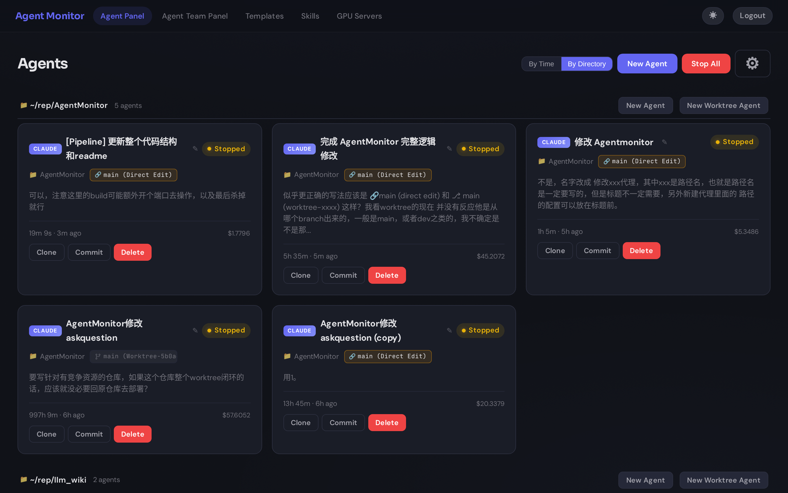
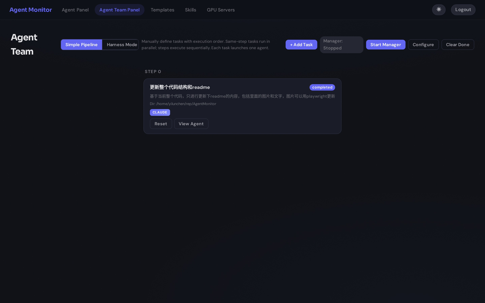

# Agent Monitor

[English](README.md) | **中文**

[](https://nodejs.org/)
[](https://www.typescriptlang.org/)
[](https://react.dev/)

Agent Monitor 是一个本地优先的 **Claude Code** 与 **Codex** 工作台。它把命令行中的编程 Agent 会话变成一个持久的 Web 应用：按代码仓库组织 Agent，在网页里对话、查看文件、打开真实终端，用 Git worktree 隔离修改，并从同一个界面编排多 Agent 任务。

它已经不只是“进程监控面板”，而是围绕编程 Agent 完整生命周期的控制层：

```text
选择项目 → 创建或发现 Agent → 对话 / 终端 / 文件
         → 查看状态与改动 → 恢复、克隆，或继续编排更多 Agent
```



## 当前产品结构

顶部导航就是当前产品的信息架构。

| 页面 | 用途 |
| --- | --- |
| **Agent Panel** | 主工作台。按时间或项目目录查看 Agent，掌握实时状态与用量，并为项目创建 Direct Edit 或 Worktree Agent。 |
| **Agent Chat** | 完整的会话工作区，包含流式对话、工具调用、计划审批、交互问题、附件、文件浏览和 PTY 终端。 |
| **Agent Team Panel** | 运行手工定义的串行/并行任务，或通过 Harness 模式完成规划、执行、评估和修订。 |
| **Templates** | 管理可复用的 `CLAUDE.md` / `AGENTS.md` 指令内容。 |
| **Skills** | 创建技能、附带脚本，并导入本机已有的 Claude 或 Codex 技能。 |
| **GPU Servers** | 可选功能；监控可通过 SSH 访问的 NVIDIA 服务器，并打开交互式远程终端。 |

### Agent Panel：围绕项目，而不只是进程

仪表盘可以按时间或工作目录排列 Agent。按目录分组时，代码仓库成为工作流中心：每个目录分区展示其所有 Agent，并提供创建 Direct Edit / Worktree Agent 的快捷入口。

每张卡片都展示无需进入会话即可判断下一步的信息：Provider、来源、状态、项目、Git 分支/工作区模式、任务摘要、活动时间，以及费用或 Token 用量。你可以直接打开、克隆、停止、删除 Agent，或让已完成的 Agent 提交当前修改。

服务端可以扫描本机 Claude Code / Codex 进程，并通过外部 Agent API 导入选中的会话。导入后的会话仅在底层进程存活时以 `EXT` 标记出现，也可以整体隐藏；这一行为不会影响由 Agent Monitor 创建并持久保存的 Agent。

### 一个会话，三种工作界面

打开 Agent 后，可以在同一工作目录的三种视图之间切换：

- **Chat** 通过 Socket.IO 流式展示回答和工具调用，支持 Markdown、图片输出、文件附件、排队追问、斜杠命令和推理强度调整。
- **Terminal** 是由 `node-pty` 提供的真实终端，可直接运行测试、Git 命令或 Provider CLI。
- **Files** 用于浏览当前工作区，并预览常见文本和 Markdown 文件。

会话页同时覆盖自主 Agent 需要的交互模式：

- 默认模式与 Plan 模式，以及计划批准/修订；
- 结构化问题和权限选项；
- 单击 Escape 中断、双击 Escape 打开历史恢复；
- Agent 停止后继续发送消息并恢复 Provider 会话；
- 在隔离 worktree 中选择性恢复对话和 Git 快照；
- 无需重建 Agent 即可编辑当前 Provider 的指令文件。


### Direct Edit 与隔离 Worktree

每个由 Agent Monitor 创建的 Agent 都使用以下一种工作区模式：

| 模式 | 行为 | 适合场景 |
| --- | --- | --- |
| **Direct Edit** | Agent 直接在所选目录工作；Agent Monitor 仅在 `.agent-worktrees` 下创建链接，以统一运行路径。 | 单 Agent、非 Git 目录，或希望修改立即出现在当前 checkout 中。 |
| **Worktree** | 在 `<repo>/.agent-worktrees/` 下创建隔离分支与 Git worktree。 | 多 Agent 并行、独立审查修改，以及安全的对话/代码恢复点。 |

Agent Monitor 会向 `CLAUDE.md` 或 `AGENTS.md` 注入工作区说明，在仪表盘跟踪实际分支，并把合并回基础分支保留为显式 Git 操作。

### Agent Team 与 Harness 模式

Agent Team Panel 提供两种编排方式：

- **Simple Pipeline**：手动定义任务；相同 order 的任务并行执行，后续 order 等待前序完成。
- **Harness Mode**：输入目标和可选验收标准；Planner 拆解任务，Generator 执行，Evaluator 验收或要求修订，直到通过或达到修订上限。

流水线 Agent 与单独创建的 Agent 共用 Provider、目录、指令模板、状态模型和会话页面。



## 功能概览

- 同时运行 Claude Code 与 Codex，并在运行时检测本机 CLI 支持的模型和推理能力。
- 从零创建、克隆已有 Agent，或恢复 Provider 历史会话。
- 支持面向项目的 Direct Edit 和 Git worktree 工作流。
- 实时流式同步消息、状态、上下文占用、Token 和 Claude 费用。
- 通过 Web 对话、PTY 终端、文件浏览器、Telegram 或飞书与 Agent 交互。
- 在 UI 中管理指令模板和可移植技能。
- 从 `~/.claude/skills` 与 `~/.codex/skills` 导入本机技能，并检测重名和重复内容。
- 通过 API 扫描并导入外部启动的 Claude/Codex 会话，但不接管其文件生命周期。
- 通过邮件、WhatsApp、Slack、Telegram 和飞书发送待处理事项与流水线通知。
- 使用密码保护仪表盘，并通过可选的出站 Relay 隧道远程访问。
- 支持中文和英文，以及明暗主题和可选配色方案。

## 快速开始

### 环境要求

- Node.js 20 或更高版本
- `PATH` 中至少存在一个 Provider CLI：[`claude`](https://docs.anthropic.com/en/docs/claude-code) 或 [`codex`](https://github.com/openai/codex)
- 使用 Worktree 模式时需要 Git
- 当前平台需要具备 `node-pty` 所需的本机构建环境

### 安装并以开发模式运行

```bash
git clone git@github.com:chenyilun95/AgentMonitor.git
cd AgentMonitor
npm install
npm run dev
```

打开 <http://localhost:5173>。Vite 会把 API 和 Socket.IO 请求代理到 `3456` 端口的服务端。

本仓库使用 npm workspace，因此只需在根目录执行一次 `npm install`，即可安装 `client`、`server`、`shared` 和 `relay`。服务端 postinstall 还会尽力安装或更新 `@jackwener/opencli`。

### 生产构建

```bash
npm run build
npm start -w server
```

打开 <http://localhost:3456>。Express 会从同一个进程提供构建后的 React 页面和 API。

仅在本机使用时不需要 `.env`。如需认证、通知、GPU 监控或远程中继，先复制示例：

```bash
cp .env.example .env
```

## 创建 Agent

1. 打开 **New Agent**，选择 Claude Code 或 Codex，并选择工作目录。
2. 选择 **Direct Edit** 或 **Worktree**。
3. 输入初始任务；也可以加载模板、附加技能，或恢复已有 Provider 会话。
4. 选择自动检测到的模型和推理强度，并按需调整权限或工具参数。
5. 创建 Agent。页面会立即进入对应会话，并在 CLI 进程停止后继续保留它。

创建页会检测所选目录中已有的 Provider 指令文件，并可以自动载入。高级配置包括权限模式、预算、允许/禁用工具、额外目录、MCP 配置、Chrome 集成，以及 Codex 的 sandbox/full-auto 选项。

## 配置

所有可选服务端配置都位于根目录 `.env`。完整且带注释的变量请查看 [.env.example](.env.example)。

| 功能 | 主要变量 |
| --- | --- |
| 服务端 | `PORT`、`DASHBOARD_PASSWORD`、`CLAUDE_BIN`、`CODEX_BIN`、`AGENTMONITOR_IDLE_TIMEOUT_MINUTES` |
| 邮件 | `SMTP_HOST`、`SMTP_PORT`、`SMTP_USER`、`SMTP_PASS`、`SMTP_FROM` |
| WhatsApp | `TWILIO_ACCOUNT_SID`、`TWILIO_AUTH_TOKEN`、`TWILIO_WHATSAPP_FROM` |
| Slack | `SLACK_WEBHOOK_URL` |
| Telegram | `TELEGRAM_TOKEN`、`TELEGRAM_CHAT_ID` |
| 飞书 / Lark | `FEISHU_APP_ID`、`FEISHU_APP_SECRET`、`FEISHU_ALLOWED_USERS`、`FEISHU_ADMIN_CHAT_ID` |
| GPU 监控 | `GPU_SERVERS_CONF`、`GPU_SSH_JUMP`、`GPU_SSH_IDENTITY`、`GPU_POLL_INTERVAL` 及相关 SSH 选项 |
| Relay 客户端 | `RELAY_URL`、`RELAY_TOKEN`、`RELAY_ENCRYPT` |

Agent 保留时长、会话文件删除策略、路径历史、Prompt 建议、语言、分组方式和主题等偏好，通过 UI 和本地设置存储管理。

### 远程 Relay

可选的 `relay` 包允许 Agent 所在机器主动连接公网 Relay。当运行 Provider CLI 的机器无法开放入站端口时，这种方式尤其有用。

```text
浏览器 ── HTTP/Socket.IO ──▶ 公网 Relay :3457 ◀── 出站 WebSocket ── Agent Monitor :3456
```

Relay 支持共享 Token、可选 AES-256-GCM 隧道加密、仪表盘密码和断线退避重连。具体配置见[远程访问指南](docs/guide/remote-access.md)。

### GPU 服务器

设置 `GPU_SERVERS_CONF` 后会启用 GPU Servers 页面。服务端通过 SSH 在配置主机上运行 `nvidia-smi`，选择主机后还可打开网页 SSH 终端。配置可从 [server/data/gpu-servers.example.conf](server/data/gpu-servers.example.conf) 开始。

## CLI 与 API

构建完成后，可使用内置 CLI 操作正在运行的 Agent Monitor 服务：

```bash
node server/dist/cli.js --help
node server/dist/cli.js run "修复失败的测试" --dir /path/to/repo --detach
node server/dist/cli.js ls
node server/dist/cli.js logs <agent-id>
node server/dist/cli.js send <agent-id> "继续采用第二种方案"
node server/dist/cli.js wait <agent-id>
```

服务端不在 `http://localhost:3456` 时，可以设置 `AGENTMONITOR_URL` 或传入 `--url`。CLI 还支持停止/删除 Agent、按标签或状态过滤、JSON 输出，以及为 `run` 指定 JSON Schema 结构化输出。

REST API 覆盖 Agent、任务、模板、技能、会话、目录、设置、上传和 GPU 状态；Socket.IO 负责实时 Agent 增量、交互提示、终端 I/O、任务事件与 GPU 快照。端点详情见 [API 文档](docs/api/index.md)。

## 仓库架构

```text
AgentMonitor/
├── client/                 React 19 + Vite Web 应用
│   └── src/
│       ├── pages/          Dashboard、AgentChat、Pipeline、Templates、Skills、GPU
│       ├── components/     终端、文件浏览、交互提示、历史、附件
│       ├── api/            REST 客户端与 Socket.IO 连接
│       └── i18n/           七种语言的 UI 文案
├── server/                 Express + Socket.IO 控制层
│   └── src/
│       ├── routes/         REST 资源与认证
│       ├── services/       Agent 进程、worktree、会话、流水线、机器人、GPU
│       ├── socket/         实时对话与终端事件处理
│       └── store/          Agent、任务、模板与设置的持久化
├── shared/                 前后端共享的 TypeScript 模型、DTO、事件与加密逻辑
├── relay/                  可选的公网 HTTP/WebSocket 代理与隧道服务
├── skills/                 可通过 Agent Monitor 附加的技能
└── docs/                   VitePress 指南、API、设计计划与截图
```

运行时由服务端作为事实来源：它负责启动或恢复 Provider CLI、解析结构化输出和会话日志、管理工作区、持久化快照，并向客户端发送轻量实时增量。客户端是操作界面；`shared` 包保证两端的数据和事件契约一致。Relay 模式转发同一套 HTTP 与 Socket.IO 接口，而不是维护第二套控制层。

## 开发

```bash
npm run dev          # shared watcher + server watcher + Vite client
npm run build        # 构建 shared、client 和 server
npm test             # 运行 shared、server 和 client 的 Vitest 测试
npm run docs:dev     # 本地启动 VitePress 文档
npm run docs:build   # 构建文档
```

更详细的资料位于 [docs/](docs/index.md)，包括 [Agent Chat](docs/guide/agent-chat.md)、[流水线](docs/guide/pipeline.md)、[通知](docs/guide/notifications.md)和[配置](docs/guide/configuration.md)。
