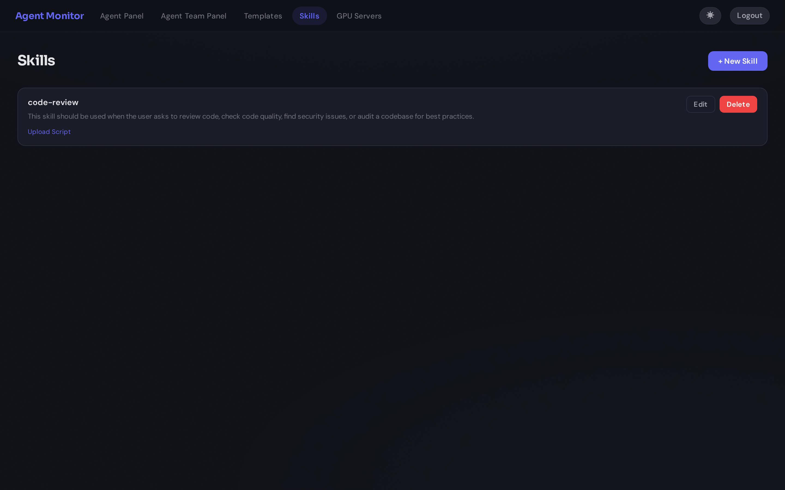
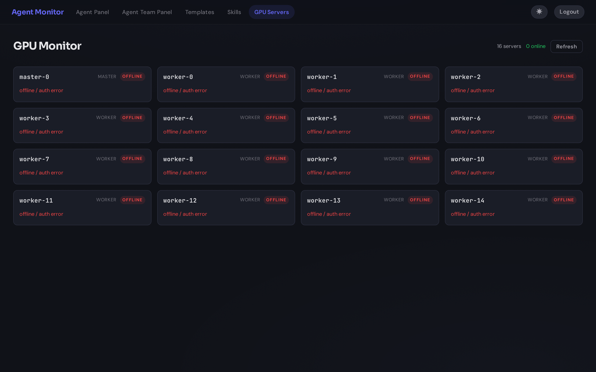

# Agent Monitor

**English** | [中文文档](README-zh.md)

[](LICENSE)
[](https://nodejs.org/)
[](https://www.typescriptlang.org/)
[](https://react.dev/)
[](server/__tests__)
[](https://ericonaldo.github.io/AgentMonitor/)

A web dashboard to run, monitor, and manage **Claude Code** and **Codex** agents in one place. Create agents with cloneable task templates, orchestrate pipelines with harness mode, and receive notifications via Email / WhatsApp / Slack / Telegram / Feishu — all from your browser or CLI.

**[Documentation](https://ericonaldo.github.io/AgentMonitor/)** | **[Quick Start](#quick-start)**

---

## Table of Contents

- [Key Features](#key-features)
- [Demo](#demo)
- [Screenshots](#screenshots)
- [Quick Start](#quick-start)
- [CLI](#cli)
- [Configuration](#configuration)
- [Usage](#usage)
- [API Reference](#api-reference)
- [Remote Access (Relay Mode)](#remote-access-relay-mode)
- [Feishu (Lark) Bot Integration](#feishu-lark-bot-integration)
- [Telegram Bot Integration](#telegram-bot-integration)
- [Provider Support](#provider-support)
- [Testing](#testing)
- [Architecture](#architecture)
- [License](#license)

---

## Key Features

### Spin Up Agents Instantly with Cloneable Templates
- **Clone agent** — Duplicate any agent's configuration (directory, provider, flags, instruction content) to instantly spin up a new one with the same setup — no re-entering settings
- **Instruction templates** — Create reusable instruction sets and load them when spawning agents or pipeline tasks (`CLAUDE.md` for Claude, `AGENTS.md` for Codex), with built-in `OpenCLI Skill Starter` and `Karpathy Coding Guardrails` templates auto-seeded on first run
- **Auto-detect instruction files** — When selecting a project directory, automatically detects existing instruction files with provider-aware fallback
- **Auto-detect model options** — Create Agent shows provider-specific model choices detected from your locally installed CLI version
- **Live editing** — Modify an agent's instruction content at any time without restarting
- **Labels** — Tag agents with arbitrary key-value labels for filtering and organization on the dashboard

### Multi-Agent Orchestration
- **Unified dashboard** — Create, monitor, and manage Claude Code and Codex agents from a single interface
- **Task pipelines** — Define sequential and parallel task workflows; the built-in Meta Agent Manager automates execution end-to-end (validates pending tasks before start)
- **Harness mode** — A structured Planner-Generator-Evaluator pipeline: a planner agent decomposes a high-level goal into subtasks, generator agents execute them, and evaluator agents review the results with automatic revision loops (configurable max revisions per task)
- **Workspace modes** — Choose per-agent: **Worktree** (isolated git worktree branch, merge back when done) or **Direct Edit** (work directly in the repo, no worktree overhead)

### Skills System
- **Reusable skills** — Define skill definitions with description, body (Markdown with YAML frontmatter), and attached script files
- **Attach to agents** — Select skills at agent creation time to inject specialized capabilities
- **Manage via UI** — Full CRUD on the Skills page with script upload support

### External Agent Discovery
- **Auto-detect running agents** — Claude Code and Codex processes started outside the dashboard (e.g., from a terminal) are automatically discovered and displayed with an **EXT** badge
- **Automatic session import** — Existing local sessions are loaded from provider logs (`~/.claude/projects/**.jsonl` and `~/.codex/sessions/**.jsonl`) so history appears automatically after discovery
- **History + live tail sync** — User/assistant/tool messages, token/context metadata, and status changes continue syncing from local session files in real time
- **Running-only visibility** — External cards are only shown while their underlying process is alive; closed external sessions are removed automatically
- **Safe deletion model** — External cards cannot be deleted from Agent Monitor (source of truth is the local CLI process/session files)
- **Internal-agent visibility unchanged** — Internal agents created by Agent Monitor remain visible after stop (until manual delete or retention cleanup)
- **Toggle visibility** — Show or hide external agents on the dashboard with a single click; preference persists across sessions

### Real-Time Monitoring & Interaction
- **Live streaming** — Watch agent output in real-time over WebSocket (works locally and through relay), with automatic polling fallback
- **PTY web terminal** — Toggle a fully interactive shell (node-pty + xterm.js) in the agent's working directory — run any command, launch `claude`, or debug directly from the browser
- **Built-in OpenCLI toolchain** — `server` install automatically syncs `@jackwener/opencli` to latest and exposes `opencli` to agent subprocesses via PATH
- **Web chat interface** — Structured chat view with 25+ slash commands matching CLI behavior; both interfaces coexist and you can switch freely
- **Plan mode** — Agents can operate in plan mode where they propose a plan for approval before execution; approve, revise, or reject plans from the chat UI
- **Session resume** — Send a message to a stopped agent to automatically restart it with `--resume`, continuing the conversation with full history. Dash-prefixed Codex prompts such as `--help` are forwarded as plain chat input, not CLI flags
- **Conversation restore** — Roll back to a previous conversation turn with optional code restore via git snapshots
- **Interactive prompts** — When an agent needs input (permission prompts, choices), the web UI shows notification banners and clickable choice buttons
- **Cost & token tracking** — Per-agent cost (Claude) and token usage (Codex) displayed in real time
- **File attachments** — Paste images/files from clipboard (Ctrl+V) or click the attach button to send files with your message; supports all file types up to 50 MB, with inline preview chips showing filename, size, and a remove button
- **Double-Esc interrupt** — Press Escape twice to send SIGINT to any running agent
- **Auto-delete expired agents** — Configurable retention period for stopped internal agents (default 24h, adjustable in Settings)
- **Configurable delete behavior** — For monitor-created agents, choose per-delete strategy for session files: ask every time, do not purge session files, or always purge session files by `sessionId`

### GPU Server Monitor
- **Remote GPU monitoring** — Monitor GPU utilization, memory, and temperature across SSH-accessible servers via `nvidia-smi`
- **Interactive SSH terminals** — Click any server card to open a full SSH terminal session in the browser
- **Real-time polling** — Configurable polling interval with live updates via Socket.IO
- **SSH jump host support** — Connect through bastion hosts with connection multiplexing

### Notifications — Email, WhatsApp, Slack, Telegram & Feishu

Stay informed wherever you are. Agent Monitor sends instant notifications when agents need human attention.

| Channel | Provider | Setup |
|---------|----------|-------|
| **Email** | Any SMTP server (Gmail, Outlook, Mailgun, etc.) | Configure `SMTP_*` environment variables |
| **WhatsApp** | Twilio API | Configure `TWILIO_*` environment variables |
| **Slack** | Slack Incoming Webhooks | Configure `SLACK_WEBHOOK_URL` or per-agent webhook |
| **Telegram** | Telegram Bot API | Configure `TELEGRAM_TOKEN` — bidirectional chat with agents |
| **Feishu (Lark)** | Feishu Open Platform (WebSocket bot) | Configure `FEISHU_*` variables — sends **interactive cards with reply buttons** |

Notifications are triggered when:
- An agent enters `waiting_input` state and needs human intervention
- A pipeline task fails
- A stuck agent exceeds the configurable timeout threshold
- The entire pipeline completes

All channels can be enabled simultaneously — configure an admin email, WhatsApp phone number, Slack webhook, Telegram bot, and/or Feishu chat per agent or globally for the Agent Manager.

> See the [Notifications Guide](docs/guide/notifications.md) for detailed setup instructions.

### Feishu (Lark) Bot & Notifications
Chat with your agents and receive rich interactive alerts directly in Feishu. The bot connects via WebSocket — no public URL required — and displays live, updateable agent cards with clickable choice buttons for permission prompts and pipeline alerts.

### Remote Access via Relay Server
- **Access from anywhere** — Manage agents from your phone, laptop, or any device through a public relay server
- **Secure WebSocket tunnel** — The agent machine connects outbound to the relay; no inbound ports needed
- **Encrypted tunnel** — Optional AES-256-GCM encryption for tunnel messages (`RELAY_ENCRYPT=1`)
- **Batch remote agents** — Run and monitor dozens of agents on a powerful remote machine while controlling them from any lightweight device
- **Password-protected dashboard** — JWT-based authentication with 24-hour session expiry (set `DASHBOARD_PASSWORD` for local dashboard or relay password for remote)
- **Auto-reconnect** — Tunnel reconnects automatically if the connection drops (exponential backoff)
- **Zero overhead locally** — When relay is not configured, the server runs in local-only mode with no extra cost

```
Phone / Laptop ──HTTP──▶ Public Server (Relay :3457) ◀──WS tunnel── Agent Machine (:3456)
```

> See the [Remote Access Guide](docs/guide/remote-access.md) for setup instructions.

### Internationalization
- **7 languages**: English, Chinese (中文), Japanese (日本語), Korean (한국어), Spanish, French, German
- Language selector persisted across sessions

---

## Demo

### Quick Start — Create Agent with Template


*Create agent with CLAUDE.md template → agent runs autonomously → task completes*

### Chat & Terminal


*Interactive chat → agent responds with tool calls → PTY terminal → clone agent*

### Task Pipeline


*Agent Manager: add tasks → start manager → watch agents run sequentially*

---

## Screenshots

| Dashboard | Agent Team Pipeline |
|-----------|---------------------|
|  |  |

| Create Agent | Templates |
|--------------|-----------|
|  |  |

| Skills | GPU Server Monitor |
|--------|--------------------|
|  |  |

| Multi-Language Support |
|------------------------|
|  |

---

## Quick Start

### Prerequisites

- **Node.js** >= 18
- **Claude Code CLI** (`claude`) — for Claude agents. Agent Monitor detects supported `--effort` values from your installed CLI at runtime; older Claude Code releases may expose only `low`, `medium`, and `high`, while newer releases may also expose `max`
- **Codex CLI** (`codex`) — for Codex agents
- **OpenCLI runtime** (`@jackwener/opencli`) — installed automatically during `server` dependency install (Node.js >= 20 required by OpenCLI itself)
- **Git** — for worktree isolation (optional; non-git directories work without it)

### Installation

```bash
git clone <repo-url> && cd AgentMonitor
npm install
cd server && npm install && cd ..
cd client && npm install && cd ..
```

`cd server && npm install` now includes an automatic best-effort sync of `@jackwener/opencli@latest`.

For **local-only use**, that's enough. You do **not** need to configure relay mode.

### Production

```bash
cd client && npx vite build && cd ..
cd server && npx tsx src/index.ts
```

Open **http://localhost:3456** in your browser.

### Development

```bash
npm run dev    # Starts server (tsx watch) + client (vite dev) concurrently
```

- Client dev server: http://localhost:5173 (proxies API to :3456)
- API server: http://localhost:3456

Both servers bind to `0.0.0.0` by default, so the dashboard is accessible from other devices on the same network via `http://<your-ip>:5173` (dev) or `http://<your-ip>:3456` (production).

If you're running on the same machine as your agents, stop here. The relay setup below is only for remote access from another device or public server.

---

## CLI

Agent Monitor includes a CLI tool (`agentmonitor`) for scriptable agent management. It communicates with the running server over HTTP and WebSocket.

### Installation

After `cd server && npm install && npm run build`, the `agentmonitor` binary is available:

```bash
npx agentmonitor --help
```

Or link it globally:

```bash
cd server && npm link
```

### Commands

| Command | Description |
|---------|-------------|
| `agentmonitor run <prompt>` | Create and start an agent. Streams output in foreground, or prints agent ID with `--detach` |
| `agentmonitor ls` | List agents (table output). Filter with `--label key:value` and `--status running` |
| `agentmonitor logs <id>` | Stream agent messages in real-time |
| `agentmonitor send <id> <message>` | Send a message to an agent |
| `agentmonitor stop <id>` | Stop an agent |
| `agentmonitor wait <id>` | Wait for an agent to finish (supports `--timeout`, `--json`) |
| `agentmonitor delete <id>` | Delete an agent |

### Options for `run`

| Flag | Description |
|------|-------------|
| `--detach` | Run in background, print agent ID |
| `--provider <claude\|codex>` | Agent provider (default: `claude`) |
| `--model <model>` | Model to use |
| `--dir <path>` | Working directory |
| `--name <name>` | Agent name |
| `--label <key=value>` | Add label (repeatable) |
| `--output-schema <file>` | JSON Schema file for structured output |
| `--json` | Output as JSON |
| `--skip-permissions` | Skip permission prompts |

### Global Options

| Flag | Description |
|------|-------------|
| `--url <url>` | Server URL (default: `$AGENTMONITOR_URL` or `http://localhost:3456`) |

---

## Configuration

All configuration is via environment variables. Copy `.env.example` to `.env` and set the values you need.

For a normal local setup, you can ignore all `RELAY_*` variables.

### Server

| Variable | Default | Description |
|----------|---------|-------------|
| `PORT` | `3456` | Server port |
| `CLAUDE_BIN` | `claude` | Path to Claude CLI binary |
| `CODEX_BIN` | `codex` | Path to Codex CLI binary |
| `DASHBOARD_PASSWORD` | — | Password for dashboard login (empty = auth disabled) |

### Email Notifications (SMTP)

| Variable | Default | Description |
|----------|---------|-------------|
| `SMTP_HOST` | — | SMTP server hostname (e.g., `smtp.gmail.com`) |
| `SMTP_PORT` | `587` | SMTP port (`587` for STARTTLS, `465` for TLS) |
| `SMTP_SECURE` | `false` | Set `true` for port 465 |
| `SMTP_USER` | — | SMTP username |
| `SMTP_PASS` | — | SMTP password or app-specific password |
| `SMTP_FROM` | `agent-monitor@localhost` | Sender address |

### WhatsApp Notifications (Twilio)

| Variable | Default | Description |
|----------|---------|-------------|
| `TWILIO_ACCOUNT_SID` | — | Twilio Account SID |
| `TWILIO_AUTH_TOKEN` | — | Twilio Auth Token |
| `TWILIO_WHATSAPP_FROM` | — | WhatsApp-enabled Twilio phone number (e.g., `+14155238886`) |

### Slack Notifications (Webhook)

| Variable | Default | Description |
|----------|---------|-------------|
| `SLACK_WEBHOOK_URL` | — | Default Slack Incoming Webhook URL |

### Telegram Bot

| Variable | Default | Description |
|----------|---------|-------------|
| `TELEGRAM_TOKEN` | — | Telegram bot token |
| `TELEGRAM_CHAT_ID` | — | Restrict bot to a single chat (optional) |

### GPU Server Monitor

| Variable | Default | Description |
|----------|---------|-------------|
| `GPU_SERVERS_CONF` | — | Path to GPU server configuration file |
| `GPU_SSH_JUMP` | — | SSH jump/bastion host |
| `GPU_SSH_IDENTITY` | — | SSH identity file path |
| `GPU_POLL_INTERVAL` | `10` | Polling interval in seconds (5–300) |

### Optional: Remote Relay (Tunnel)

| Variable | Default | Description |
|----------|---------|-------------|
| `RELAY_URL` | — | WebSocket URL of relay server (e.g., `ws://your-server:3457/tunnel`) |
| `RELAY_TOKEN` | — | Shared secret for tunnel authentication |
| `RELAY_ENCRYPT` | `0` | Set `1` to enable AES-256-GCM encryption for tunnel messages |

Leave both unset for local-only mode. See [Remote Access (Relay Mode)](#remote-access-relay-mode) only if you need remote access.

> If SMTP, Twilio, Slack, or Telegram credentials are not set, the respective notification channel is disabled gracefully — events are logged to the server console.

---

## Usage

### Creating an Agent

1. Click **"+ New Agent"** on the Dashboard
2. Select **Provider** — Claude Code or Codex
3. Set **Name**, **Working Directory** (use Browse to pick a directory), and **Prompt**
4. Add **Labels** — comma-separated tags for filtering on the dashboard
5. Choose **Workspace Mode** — Worktree (isolated branch) or Direct Edit (edit repo directly)
6. If the selected directory contains an instruction file (`CLAUDE.md` or `AGENTS.md`), you'll be prompted to load it automatically (provider-aware with compatibility fallback)
7. Select a **Model** from the runtime-detected dropdown (or leave `default`)
8. Configure **Flags** (e.g., `--dangerously-skip-permissions`, `--chrome`, `--permission-mode`)
9. Optionally load an instruction template and edit it inline (`CLAUDE.md` for Claude, `AGENTS.md` for Codex)
10. Optionally attach **Skills** to inject specialized capabilities
11. Enter an **Admin Email**, **WhatsApp Phone**, and/or **Slack Webhook URL** for notifications
12. Click **Create Agent**

When a model is selected:
- Claude starts with CLI `--model <selected>`
- Codex prefixes the first turn with `/model <selected>` before executing your task prompt

**Tip — Clone an existing agent:** Hit the **Clone** button on any agent card to create a new agent pre-filled with the same directory, provider, flags, and instruction file content (`CLAUDE.md` / `AGENTS.md`). Combine with templates for a reusable agent library: create a template with your standard instructions → create one agent using it → clone whenever you need a fresh instance.

Template quick start: use the built-in `OpenCLI Skill Starter` template to make agents proactively discover and use `opencli` (`opencli list`, `opencli doctor`, and JSON-first outputs), or `Karpathy Coding Guardrails` for stricter coding behavior inspired by the andrej-karpathy-skills `CLAUDE.md`.

### Dashboard

Each agent is represented by a rich information card displaying:
- **Project & git branch** — which repository and branch the agent is working on (live branch tracking with drift detection)
- **Pull Request link** — if the agent created a PR, a direct link is shown (auto-detected)
- **Model & context usage** — which LLM model and a visual bar for context window consumption
- **Status** — whether the agent is actively working, idle, or waiting for permission
- **Task description** — a summary of what the agent is currently doing
- **Labels** — filterable key-value tags for organization
- **MCP servers** — connected Model Context Protocol servers (parsed from `--mcp-config`)
- **Cost / token tracking** — per-agent cost (Claude) or token usage (Codex)

Click any card to open the full chat interface.

### Agent Chat

Send messages, view conversation history, interrupt with Double-Esc, and use slash commands:

`/help` `/clear` `/status` `/cost` `/stop` `/compact` `/model` `/export`

For Codex agents, messages that begin with `--` are safely passed after an explicit end-of-options separator, so text like `--help` or `--sandbox danger-full-access` is treated as normal conversation content.

### Task Pipeline

Orchestrate multi-step workflows with sequential and parallel task definitions. Two modes are available:

- **Simple Pipeline** — Define tasks with execution order; the Meta Agent Manager automatically provisions agents, monitors progress, sends notifications on failures, and cleans up on completion
- **Harness Mode** — A structured Planner → Generator → Evaluator pipeline: give a high-level goal and evaluation criteria, and the harness decomposes it into subtasks, executes them, reviews results, and automatically revises failing tasks (up to a configurable max revisions per task)

### Templates

Create, edit, and reuse instruction templates across agents (`CLAUDE.md` / `AGENTS.md`).

### Skills

Define reusable skill definitions with a description, body (Markdown), and attached script files. Skills can be selected when creating agents to inject specialized capabilities.

---

## API Reference

### Agents

| Method | Endpoint | Description |
|--------|----------|-------------|
| GET | `/api/agents` | List all agents (filter with `?label=key:value&status=running`) |
| GET | `/api/agents/:id` | Get agent details |
| POST | `/api/agents` | Create agent |
| POST | `/api/agents/:id/stop` | Stop agent |
| POST | `/api/agents/:id/message` | Send message |
| POST | `/api/agents/:id/interrupt` | Interrupt agent (SIGINT) |
| PUT | `/api/agents/:id/claude-md` | Update CLAUDE.md |
| PUT | `/api/agents/:id/rename` | Rename agent |
| PUT | `/api/agents/:id/interaction-mode` | Set interaction mode (`default` or `plan`) |
| PUT | `/api/agents/:id/reasoning-effort` | Update reasoning effort |
| POST | `/api/agents/:id/plan/approve` | Approve pending plan |
| POST | `/api/agents/:id/plan/revise` | Revise/reject pending plan |
| POST | `/api/agents/:id/answer-question` | Answer pending questions |
| POST | `/api/agents/:id/new-conversation` | Start a new conversation |
| POST | `/api/agents/:id/restore` | Restore to a previous turn (optional code restore) |
| PATCH | `/api/agents/:id/labels` | Update agent labels |
| GET | `/api/agents/:id/logs` | Get agent logs (`?limit=N`) |
| GET | `/api/agents/:id/wait` | Long-poll wait for completion (`?timeout=N`) |
| DELETE | `/api/agents/:id` | Delete agent (optional body: `{ "purgeSessionFiles": true\|false }`) |
| POST | `/api/agents/actions/stop-all` | Stop all agents |

### External Agent Discovery

| Method | Endpoint | Description |
|--------|----------|-------------|
| POST | `/api/external/scan` | Trigger external agent scan |
| GET | `/api/external/candidates` | List candidate processes not yet imported |
| POST | `/api/external/import` | Import a process by PID |
| POST | `/api/external/dismiss` | Dismiss a PID from candidates |

### Pipeline Tasks

| Method | Endpoint | Description |
|--------|----------|-------------|
| GET | `/api/tasks` | List pipeline tasks |
| POST | `/api/tasks` | Create task |
| GET | `/api/tasks/:id` | Get task details |
| PUT | `/api/tasks/:id` | Update a pending task |
| DELETE | `/api/tasks/:id` | Delete task |
| POST | `/api/tasks/:id/reset` | Reset task status |
| POST | `/api/tasks/clear-completed` | Clear completed/failed tasks |
| GET | `/api/meta/config` | Get meta agent config |
| PUT | `/api/meta/config` | Update meta agent config |
| POST | `/api/meta/start` | Start meta agent manager |
| POST | `/api/meta/stop` | Stop meta agent manager |
| GET | `/api/meta/status` | Get meta agent running status |
| POST | `/api/tasks/harness/start` | Start harness orchestration |
| POST | `/api/tasks/harness/stop` | Stop harness orchestration |
| GET | `/api/tasks/harness/status` | Get harness state |

### Templates

| Method | Endpoint | Description |
|--------|----------|-------------|
| GET | `/api/templates` | List templates |
| GET | `/api/templates/:id` | Get template |
| POST | `/api/templates` | Create template |
| PUT | `/api/templates/:id` | Update template |
| DELETE | `/api/templates/:id` | Delete template |

### Skills

| Method | Endpoint | Description |
|--------|----------|-------------|
| GET | `/api/skills` | List all skills |
| GET | `/api/skills/:name` | Get a skill |
| POST | `/api/skills` | Create a skill |
| PUT | `/api/skills/:name` | Update a skill |
| DELETE | `/api/skills/:name` | Delete a skill |
| POST | `/api/skills/:name/scripts` | Upload a script file (max 10 MB) |
| DELETE | `/api/skills/:name/scripts/:filename` | Delete a script |

### GPU Monitor

| Method | Endpoint | Description |
|--------|----------|-------------|
| GET | `/api/gpu/servers` | List all GPU servers with snapshots |
| GET | `/api/gpu/servers/:name` | Get snapshot for a specific server |
| POST | `/api/gpu/servers/:name/exec` | Execute a command on a remote server |
| GET | `/api/gpu/config` | Get GPU monitor configuration |
| PUT | `/api/gpu/config` | Update poll interval |

### Settings

| Method | Endpoint | Description |
|--------|----------|-------------|
| GET | `/api/settings` | Get server settings (internal-agent retention, session-file delete policy, etc.) |
| GET | `/api/settings/runtime-capabilities` | Get runtime-detected provider capabilities (reasoning efforts + model options) |
| PUT | `/api/settings` | Update server settings |

### Authentication

| Method | Endpoint | Description |
|--------|----------|-------------|
| POST | `/api/auth/login` | Login with password |
| GET | `/api/auth/check` | Check authentication status |
| POST | `/api/auth/logout` | Logout |

### Other

| Method | Endpoint | Description |
|--------|----------|-------------|
| POST | `/api/upload` | Upload file attachment (multipart, max 50 MB) |
| GET | `/api/sessions` | List previous Claude sessions |
| GET | `/api/directories?path=/home` | Browse server directories |
| GET | `/api/directories/claude-md?path=/project&provider=codex` | Check instruction file (`CLAUDE.md` / `AGENTS.md`) with compatibility fallback |
| GET | `/api/health` | Health check |

### Socket.IO Events

| Event | Direction | Description |
|-------|-----------|-------------|
| `agent:join` | Client → Server | Subscribe to agent messages |
| `agent:leave` | Client → Server | Unsubscribe |
| `agent:send` | Client → Server | Send message |
| `agent:interrupt` | Client → Server | Send interrupt |
| `agent:message` | Server → Client | Agent output (legacy) |
| `agent:update` | Server → Client | Full agent snapshot (real-time streaming) |
| `agent:delta` | Server → Client | Incremental agent state changes |
| `agent:snapshot` | Server → Client | Dashboard broadcast update |
| `agent:status` | Server → Client | Status change |
| `agent:input_required` | Server → Client | Agent needs user input |
| `task:update` | Server → Client | Pipeline task updated |
| `pipeline:complete` | Server → Client | Pipeline complete |
| `harness:complete` | Server → Client | Harness orchestration completed |
| `harness:failed` | Server → Client | Harness orchestration failed |
| `terminal:open` | Client → Server | Open PTY terminal in agent directory |
| `terminal:input` | Client → Server | Send keystrokes to PTY |
| `terminal:resize` | Client → Server | Resize PTY dimensions |
| `terminal:close` | Client → Server | Close PTY session |
| `terminal:output` | Server → Client | PTY output data |
| `terminal:exit` | Server → Client | PTY process exited |
| `gpu:snapshot` | Server → Client | GPU monitor data update |
| `gpu:terminal:open` | Client → Server | Open SSH terminal to GPU server |
| `gpu:terminal:input` | Client → Server | Send keystrokes to GPU terminal |
| `gpu:terminal:output` | Server → Client | GPU terminal output |
| `meta:status` | Server → Client | Meta agent status |

---

## Remote Access (Relay Mode)

Access the Agent Monitor dashboard from anywhere — phone, laptop, or any device — via a public relay server. The relay forwards all HTTP and WebSocket traffic through a secure tunnel.

```
Phone/Laptop → HTTP → Public Server (Relay :3457) ← WS tunnel ← Local Machine (:3456)
```

### Setup

1. **Deploy the relay** to a public server:
   ```bash
   bash relay/scripts/deploy.sh <your-secret-token> <your-dashboard-password>
   ```

2. **Connect the local server** by setting environment variables:
   ```bash
   RELAY_URL=ws://your-server:3457/tunnel RELAY_TOKEN=<your-secret-token> npx tsx server/src/index.ts
   ```

3. **Open the dashboard** from any device at `http://your-server:3457` — log in with your password

The relay supports **password-based login** via `RELAY_PASSWORD` to protect the dashboard from unauthorized access. Sessions use JWT tokens with 24-hour expiry. The tunnel auto-reconnects if the connection drops. When `RELAY_URL` is not set, the server runs in local-only mode with no relay overhead.

For encrypted tunnels, set `RELAY_ENCRYPT=1` on both the relay and the local server.

---

## Feishu (Lark) Bot Integration

Use Feishu (Lark) as an interactive bot interface alongside the web dashboard and terminals. The bot uses Feishu's **WebSocket long-connection** — no public URL needed on your agent machine.

### Features

- **Live agent cards** — Agent status, messages, cost, and branch are displayed as updateable interactive Feishu cards (auto-refreshed on every change, debounced to respect rate limits)
- **Choice buttons everywhere** — When an agent waits for human input, permission prompts and choices appear as clickable card buttons — both in the bound chat *and* in proactive notification alerts
- **Unified notifications** — Feishu replaces or complements email/WhatsApp/Slack: task failures, stuck agents, and pipeline completion all send rich cards to the admin chat instead of plain text
- **Commands** — `/list`, `/attach`, `/detach`, `/stop`, `/status`, `/help`
- **Access control** — Restrict bot access to specific Feishu `open_id`s via `FEISHU_ALLOWED_USERS`
- **Persistent bindings** — Chat-to-agent bindings survive server restarts (stored in `data/feishu_bindings.json`)

### Setup

1. Create a Feishu bot at [Feishu Open Platform](https://open.feishu.cn/app)
2. Enable permissions: **Receive messages** (`im:message.receive_v1`) and **Send messages** (`im:message:create`)
3. Enable **WebSocket long-connection** event subscription
4. Enable **Interactive card** support
5. Set environment variables:

```bash
FEISHU_APP_ID=cli_xxxxxxxxxxxxxxxx
FEISHU_APP_SECRET=xxxxxxxxxxxxxxxx

# Admin chat for pipeline notifications (task failures, pipeline complete, stuck agents)
FEISHU_ADMIN_CHAT_ID=oc_xxxxxxxxxxxx

# Optional: restrict bot to specific users (comma-separated open_ids)
FEISHU_ALLOWED_USERS=ou_xxxx,ou_yyyy
```

To send Feishu notifications for a specific agent (e.g., `waiting_input`), set `feishuChatId` when creating the agent via API:
```json
{ "feishuChatId": "oc_xxxxxxxxxxxx" }
```

### Usage

| Command | Description |
|---------|-------------|
| `/list` | List all agents with status and a "Connect" button |
| `/attach <name or ID>` | Bind this chat to an agent (shows live card) |
| `/detach` | Unbind from the current agent |
| `/stop` | Stop the currently bound agent |
| `/status` | Refresh the current agent's status card |
| `/help` | Show this help |

Once attached, send free text to forward it directly to the agent. When the agent is waiting for input, click a choice button or type a reply.

---

## Telegram Bot Integration

Use Telegram as a bidirectional chat interface with your agents. The bot uses polling mode — no webhook or public URL required.

### Features

- **Bidirectional communication** — Send messages to agents and receive streaming output in Telegram
- **Agent management** — Create, stop, attach, and detach agents directly from Telegram
- **Live status updates** — Receive notifications on agent status changes and permission prompts
- **Persistent bindings** — Chat-to-agent bindings survive server restarts
- **Access control** — Optionally restrict to a single chat via `TELEGRAM_CHAT_ID`

### Setup

1. Create a Telegram bot via [@BotFather](https://t.me/botfather)
2. Set environment variables:

```bash
TELEGRAM_TOKEN=your-bot-token

# Optional: restrict to a single chat
TELEGRAM_CHAT_ID=your-chat-id
```

### Commands

| Command | Description |
|---------|-------------|
| `/help` | Show help |
| `/list` | List all agents with status, cost, and task |
| `/create <dir> <prompt>` | Create a new agent and auto-bind |
| `/attach <name or id>` | Bind chat to an agent |
| `/detach` | Unbind from agent |
| `/stop [id]` | Stop bound agent (or specified ID) |
| `/status` | Show bound agent details |
| `/logs [n]` | Show last N messages (default 5) |

Once attached, send free text to forward it directly to the agent.

---

## Provider Support

| | Claude Code | Codex |
|---|---|---|
| **Binary** | `claude` | `codex` |
| **Flags** | `--dangerously-skip-permissions`, `--permission-mode`, `--chrome`, `--max-budget-usd`, `--allowedTools`, `--disallowedTools`, `--add-dir`, `--mcp-config`, `--resume`, `--model` | `--dangerously-bypass-approvals-and-sandbox`, `--sandbox danger-full-access`, `-c approval_policy="never"` |
| **Model Selection** | Runtime-detected dropdown, applied via `--model` on start | Runtime-detected dropdown, applied via `/model <name>` at the beginning of the first turn |
| **Tracking** | Cost (USD) | Token usage |

---

## Testing

```bash
npm test    # 202 tests
```

---

## Architecture

```
AgentMonitor/
  shared/                     # @agent-monitor/shared — types, DTOs, events
    src/models/               # Agent, Task, Template, Skill, GpuServer, etc.
    src/api/                  # Event names, API types
  server/                     # Node.js + Express + Socket.IO
    src/
      cli.ts                  # CLI entry point (agentmonitor command)
      lib/cliClient.ts        # CLI HTTP/WS client library
      auth.ts                 # JWT authentication middleware
      services/
        AgentProcess.ts       # CLI process wrapper
        AgentManager.ts       # Agent lifecycle
        MetaAgentManager.ts   # Pipeline orchestration
        HarnessOrchestrator.ts # Planner-Generator-Evaluator pipeline
        HandoffManager.ts     # Inter-task handoff files
        SkillManager.ts       # Skill CRUD with script attachments
        ExternalAgentScanner.ts # External agent discovery
        TunnelClient.ts       # Outbound tunnel to relay server
        tunnelBridge.ts       # Event bridge for tunnel
        TerminalService.ts    # PTY terminal management (node-pty)
        WorktreeManager.ts    # Git worktree ops
        GpuMonitorService.ts  # SSH-based GPU monitoring
        EmailNotifier.ts      # SMTP email notifications
        WhatsAppNotifier.ts   # Twilio WhatsApp notifications
        SlackNotifier.ts      # Slack webhook notifications
        FeishuService.ts      # Feishu/Lark bot (WebSocket)
        TelegramService.ts    # Telegram bot integration
        SessionReader.ts      # Session history
        DirectoryBrowser.ts   # Directory listing
        RuntimeCapabilities.ts # CLI version / model detection
      store/AgentStore.ts     # JSON persistence
      routes/                 # REST endpoints (agents, tasks, templates, skills, gpu, auth)
      socket/handlers.ts      # WebSocket handlers
    __tests__/                # Test suite (202 tests)
  relay/                      # Public relay server (deployed independently)
    src/
      index.ts                # Relay entry point
      tunnel.ts               # TunnelManager (WS server)
      httpProxy.ts            # HTTP forwarding through tunnel
      socketBridge.ts         # Socket.IO ↔ tunnel bridge
      config.ts               # Relay configuration
    scripts/deploy.sh         # Build & deploy to public server
  client/                     # React 19 + Vite
    src/
      pages/                  # Dashboard, Chat, Pipeline, Templates, Skills, GpuMonitor
      components/             # TerminalView, FileBrowser, HistoryPicker, etc.
      i18n/                   # 7-language localization (EN/ZH/JA/KO/ES/FR/DE)
      api/                    # REST + Socket.IO clients
```

---

## License

MIT
